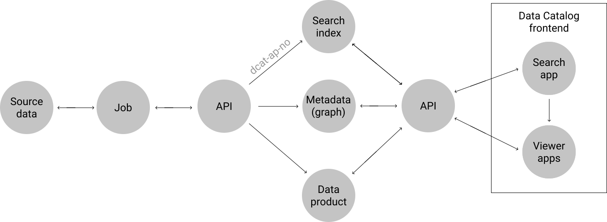

# Dakan. NAV data catalog / metadatahub 

## Contact

Slack: #data-catalog-intern

## Front end applications

[Public](https://data.nav.no)

[Internal](https://data.adeo.no)

[Test/Preprod (VDI) ](https://data.nais.preprod.local)

## What is a data catalog / (meta)data hub?

### About data catalogs

* [DataHub: Popular metadata architectures explained. Linkedin Engineering. December 2020](https://engineering.linkedin.com/blog/2020/datahub-popular-metadata-architectures-explained)
* [A Dive into Metadata Hub Tools. Towards Data Science. Sept 2020](https://towardsdatascience.com/a-dive-into-metadata-hub-tools-67259804971f)

### Open source projects

* [Amundsen. Lyft, LF AI & Data Foundation](https://github.com/amundsen-io/amundsen/)
* [Datahub. Linkedin](https://github.com/linkedin/datahub)
* [Marquez. WeWork, LF AI & Data Foundation](https://github.com/MarquezProject/marquez)
* [Metacat. Netflix](https://github.com/Netflix/metacat)

### Closed source

* [Data Catalog. Google](https://cloud.google.com/data-catalog)
* [Glue. AWS](https://aws.amazon.com/glue)
* [Data Catalog. Microsoft Azure](https://azure.microsoft.com/en-us/services/data-catalog/)
* [Dataportal. Airbnb](https://medium.com/airbnb-engineering/democratizing-data-at-airbnb-852d76c51770)
* [Lexikon. Spotify](https://engineering.atspotify.com/2020/02/27/how-we-improved-data-discovery-for-data-scientists-at-spotify/)
* [Databook. Uber](https://eng.uber.com/databook/)

## Why Dakan

The motivation behind Dakan is to

* Enable dataproduct and datamesh thinking in NAV
* Provide infrastructure for a shared metadata graph in NAV
* Allow presenting rich dataproducts directly in the the catalog UI

### Metadata graph

## Architecture

Data sources (batch or streaming) are processed by jobs. Jobs can be coded in jupyter notebooks, python scripts or in your language of choice. The code for on-premises jobs is packaged from source files on github and executed on Kubernetes (NAIS). Scheduling of the jobs is defined in a yaml file in a IaC repo or in Airflow. On GCP jobs can also be defined in [Cloud Data Fusion](https://cloud.google.com/data-fusion) or [Dataflow](https://cloud.google.com/dataflow)

### Ingestion

* [Jupyter notebooks](https://github.com/navikt/data-catalog-indexers)
* [Scheduling - open data DAGs](https://github.com/navikt/opendata-dags)
* [Open data notebooks](https://github.com/navikt/opendata)

### Airflow

* [Airflow IaC](https://github.com/navikt/knada-airflow)
* [Custom Airflow operators](https://github.com/navikt/dataverk-airflow)

### Frontend

The frontend app consists of a search page backed by elastic search and a number of independent 'viewer' apps. Each type of content in the catalog is associated with a dedicated viewer app. The motivation for the microfrontend architecture is to lower the barrier for independent teams to develop and maintain custom viewers for their content types. 

[Viewer apps:](https://github.com/navikt/dakan/tree/master/packages/viewers)

* [Database table](https://github.com/navikt/dakan/tree/master/packages/viewers/table)
* [On-prem Kafka topic](https://github.com/navikt/dakan/tree/master/packages/viewers/kafka)
* [Aiven Kafka topic](https://github.com/navikt/dakan/tree/master/packages/viewers/kafkaaiven)
* [App](https://github.com/navikt/dakan/tree/master/packages/viewers/naisapp)
* [API](https://github.com/navikt/dakan/tree/master/packages/viewers/api)
* [System](https://github.com/navikt/dakan/tree/master/packages/viewers/system)
* [Tableau workbook](https://github.com/navikt/dakan/tree/master/packages/viewers/tableau)
* [Terms](https://github.com/navikt/dakan/tree/master/packages/viewers/term)

* [Person](https://github.com/navikt/dakan/tree/master/packages/viewers/person)
* [Team](https://github.com/navikt/dakan/tree/master/packages/viewers/team)
* [Product areas](https://github.com/navikt/dakan/tree/master/packages/viewers/productarea)
* [Office](https://github.com/navikt/dakan/tree/master/packages/viewers/office)

### Backend 

Metadata relevant for search is stored in dcat format in Elastic search
More comprehensive metadata is stored in a graph database (CosmosDB Gremlin).
Data is stored in buckets, either S3 on prem (internal data) or Google Cloud Storage (public data) 

### APIs

[Elastic search, bucket storage and APM API](https://github.com/navikt/dataverk-api)

[Metadata Graph API](https://github.com/navikt/data-catalog-api)

[DCAT metadata in RDF format API](https://github.com/navikt/digdir-api)

### Tools

[Dataverk ETL toolbox](https://github.com/navikt/dataverk)

[DCAT format validation helper](https://github.com/navikt/data-catalog-dcat-validator)

[Data profiling and data quality monitoring](https://github.com/navikt/nada-koala)

### Integrations

[Felles datakatalog](https://data.norge.no/) harvests data from Dakan trough an API. The API converts dcat-ap metadata in JSON format from Elastic Search to RDF format. The API is based on two utility libraries developed by [Digitaliseringsdirektoratet](https://github.com/Informasjonsforvaltning):
* [concepttordf](https://github.com/Informasjonsforvaltning/concepttordf) to map concept collections to the skos-ap-no specification.
* [datacatalogtordf](https://github.com/Informasjonsforvaltning/datacatalogtordf) to map the collection to RDF.

[Open API/Swagger](https://data.nav.no/digdir-api/docs)

[Source (github)](https://github.com/navikt/digdir-api)

## UI & design

### Theming
Theming for the frontend apps is defined in a JSON file. [NAV theme](https://navikt.github.io/dakan/story/themes-nav--theme)  

### Design elements on Figma

* [Designelementer, verktøykasse](https://www.figma.com/proto/NPmUvNUbKhBJ2bKH88Tp1F/Datakatalogen)
* [UI](https://www.figma.com/file/NPmUvNUbKhBJ2bKH88Tp1F/Datakatalogen?node-id=109%3A0)

### Shared UI components 

* [Demo (storybook)](https://navikt.github.io/dakan/story/themes-nav--samples)
* [Source (github)](https://github.com/navikt/dakan/tree/master/packages/shared/ui)

### Contact

Slack: #datakalog-design

